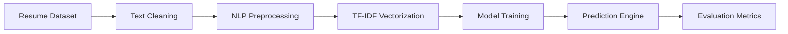

<div align="center">

# AI Resume Screening System

<p align="center">
  
</p>

<p align="center">
  
  
  
  
  
</p>

<br>


</div>

## Overview

This project is an end-to-end AI-based Resume Screening System designed to automate resume classification using Natural Language Processing and Machine Learning.

The system processes resume text, performs NLP-based preprocessing, extracts textual features using TF-IDF Vectorization, and predicts the corresponding job category using machine learning models.

Built as a Kaggle notebook project, this repository demonstrates practical applications of:

* Natural Language Processing
* Text Classification
* Machine Learning Pipelines
* Feature Engineering
* Resume Analytics

---

## Dataset

Dataset Source:

```bash
/kaggle/input/datasets/snehaanbhawal/resume-dataset
```

The dataset contains resumes from multiple professional domains including:

| Categories          |
| ------------------- |
| Data Science        |
| Python Developer    |
| Java Developer      |
| HR                  |
| Testing             |
| DevOps Engineer     |
| Business Analyst    |
| Web Designing       |
| Mechanical Engineer |
| Sales               |

---

## Architecture



---

## Technology Stack

<table>
<tr>
<td width="50%">

### Core Technologies

* Python
* Jupyter Notebook
* Kaggle
* Scikit-learn
* XGBoost

</td>
<td width="50%">

### Libraries Used

* Pandas
* NumPy
* Matplotlib
* Seaborn
* Regex
* TF-IDF Vectorizer

</td>
</tr>
</table>

---

## Machine Learning Pipeline

### Data Preprocessing

* Text cleaning using regex
* Lowercase normalization
* Removal of URLs and special characters
* Noise reduction

### Feature Engineering

* TF-IDF Vectorization
* Numerical feature extraction from resume text

### Models Used

| Model         | Purpose               |
| ------------- | --------------------- |
| Random Forest | Resume Classification |
| XGBoost       | Optimized Prediction  |

### Evaluation Metrics

* Accuracy Score
* Classification Report
* Confusion Matrix
* Model Comparison

---

## Project Structure

```bash
AI-Resume-Screening-System/
│
├── ai-resume-screening-system.ipynb
├── README.md
├── LICENSE
└── dataset/
```

---

## Installation

### Clone Repository

```bash
git clone https://github.com/Donamol-Joseph/AI-Resume-Screening-System.git
```

### Navigate to Project

```bash
cd AI-Resume-Screening-System
```

### Install Dependencies

```bash
pip install pandas numpy matplotlib seaborn scikit-learn xgboost
```

### Launch Notebook

```bash
jupyter notebook
```

Open:

```bash
ai-resume-screening-system.ipynb
```

---

## Key Highlights

<table>
<tr>
<td>

* Automated Resume Classification
* NLP-based Text Processing
* TF-IDF Feature Extraction
* Multiple ML Models
* Data Visualization
* End-to-End ML Workflow

</td>
<td>


</td>
</tr>
</table>

---

## Future Enhancements

* Streamlit Deployment
* Resume Ranking System
* PDF Resume Upload Support
* Deep Learning Integration
* ATS Dashboard Development

---

## Author

<div align="left">

<strong>Donamol Joseph</strong>

<br><br>

<a href="https://github.com/Donamol-Joseph">
  
</a>

<a href="https://www.linkedin.com/in/donamoljoseph/">
  
</a>

<a href="mailto:donajoseph272006@gmail.com">
  
</a>

</div>

---

<div align="center">

<sub>Built with Machine Learning and Natural Language Processing</sub>

</div>
