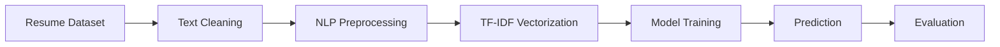

<div align="center">

# AI Resume Screening System

<p align="center">
  
</p>

<p align="center">
  
  
  
  
  
</p>

</div>

---

## Overview

The AI Resume Screening System is a machine learning and natural language processing project designed to automate resume classification across multiple professional domains.

The system processes resume text, performs preprocessing and feature extraction using TF-IDF Vectorization, and predicts the corresponding job category using machine learning models.

This project demonstrates practical applications of:

* Natural Language Processing
* Text Classification
* Feature Engineering
* Machine Learning Pipelines
* Resume Analytics

---

## Dataset

Dataset used from Kaggle:

```bash
/kaggle/input/datasets/snehaanbhawal/resume-dataset
```

The dataset contains resumes from multiple categories including:

| Categories          |
| ------------------- |
| Data Science        |
| Python Developer    |
| Java Developer      |
| HR                  |
| DevOps Engineer     |
| Business Analyst    |
| Web Designing       |
| Testing             |
| Sales               |
| Mechanical Engineer |

---

## Workflow



---

## Technology Stack

| Category             | Technologies                       |
| -------------------- | ---------------------------------- |
| Programming Language | Python                             |
| Libraries            | Pandas, NumPy, Matplotlib, Seaborn |
| NLP Techniques       | Regex, TF-IDF Vectorization        |
| Machine Learning     | Random Forest, XGBoost             |
| Environment          | Kaggle Notebook, Jupyter Notebook  |

---

## Core Capabilities

* Automated Resume Classification
* NLP-based Text Processing
* TF-IDF Feature Extraction
* Machine Learning Model Training
* Model Evaluation and Comparison
* Data Visualization and Analysis
* End-to-End Prediction Pipeline

---

## Machine Learning Pipeline

### Data Preprocessing

* Removal of URLs and special characters
* Text normalization and cleaning
* Lowercase transformation
* Noise reduction using regex

### Feature Engineering

* TF-IDF Vectorization
* Numerical feature transformation from textual resume data

### Models Used

| Model                    | Purpose               |
| ------------------------ | --------------------- |
| Random Forest Classifier | Resume Classification |
| XGBoost Classifier       | Optimized Prediction  |

### Evaluation Metrics

* Accuracy Score
* Classification Report
* Confusion Matrix
* Model Performance Comparison

---

## Project Structure

```bash
AI-Resume-Screening-System/
│
├── ai-resume-screening-system.ipynb
├── README.md
├── LICENSE
└── dataset/
```

---

## Installation

### Clone Repository

```bash
git clone https://github.com/Donamol-Joseph/AI-Resume-Screening-System.git
```

### Navigate to Project Directory

```bash
cd AI-Resume-Screening-System
```

### Install Dependencies

```bash
pip install pandas numpy matplotlib seaborn scikit-learn xgboost
```

### Launch Notebook

```bash
jupyter notebook
```

Open the notebook:

```bash
ai-resume-screening-system.ipynb
```

---

## Results

The trained models successfully classify resumes into their respective job categories using NLP and machine learning techniques.

The project demonstrates effective performance in identifying resume domains from textual content.

---

## Future Improvements

* Streamlit or Flask Deployment
* Resume Ranking System
* PDF Resume Upload Support
* Deep Learning Integration
* ATS Dashboard Development

---

## Author

**Donamol Joseph**

<p>
<a href="https://github.com/Donamol-Joseph">
  
</a>

<a href="https://www.linkedin.com/in/donamoljoseph/">
  
</a>

<a href="mailto:donajoseph272006@gmail.com">
  
</a>
</p>

---

<div align="center">

Built using Machine Learning and Natural Language Processing

</div>
