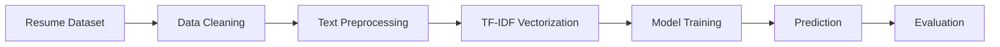

<div align="center">

# AI Resume Screening System


<p align="center">
  
  
  
  
</p>


</div>

---

# Project Overview

An advanced **AI-powered Resume Screening System** developed using **Machine Learning** and **Natural Language Processing (NLP)** techniques to automatically classify resumes into different job domains.

This project demonstrates how AI can assist recruiters and HR professionals by automating resume filtering and improving hiring efficiency.

---

# Features

Automated Resume Classification
NLP-based Text Cleaning & Processing
Exploratory Data Analysis (EDA)
📑 TF-IDF Feature Extraction
Machine Learning Model Training
Model Evaluation & Comparison
⚡ High Accuracy Resume Prediction
🎯 End-to-End AI Pipeline

---

# Machine Learning Workflow



---

# Dataset Information

### Kaggle Dataset

```bash
/kaggle/input/datasets/snehaanbhawal/resume-dataset
```

### Categories Included

* Data Science
* Python Developer
* Java Developer
* HR
* DevOps Engineer
* Web Designing
* Testing
* Business Analyst
* Sales
* Mechanical Engineer
* And More...

---

# Tech Stack

<div align="center">

| Category  | Technologies                       |
| --------- | ---------------------------------- |
| Language  | Python                             |
| Libraries | Pandas, NumPy, Matplotlib, Seaborn |
| NLP       | Regex, TF-IDF Vectorizer           |
| ML Models | Random Forest, XGBoost             |
| Tools     | Jupyter Notebook, Kaggle           |

</div>

---

# Exploratory Data Analysis

The notebook includes:

✔ Resume category distribution
✔ Count plots and visualizations
✔ Feature importance analysis
✔ Confusion matrix visualization
✔ Model performance comparison

---

# Models Used

<div align="center">

| Model                    | Purpose                     |
| ------------------------ | --------------------------- |
| Random Forest Classifier | Resume Classification       |
| XGBoost Classifier       | High Performance Prediction |
| TF-IDF Vectorizer        | Text Feature Extraction     |

</div>

---

# Project Structure

```bash
AI-Resume-Screening-System/
│
├── README.md
├── LICENSE
├── ai-resume-screening-system.ipynb
└── dataset/
```

---

# Installation & Setup

## 1. Clone Repository

```bash
git clone https://github.com/Donamol-Joseph/AI-Resume-Screening-System.git
```

## 2. Navigate to Project Folder

```bash
cd AI-Resume-Screening-System
```

## 3. Install Dependencies

```bash
pip install pandas numpy matplotlib seaborn scikit-learn xgboost
```

## 4. Launch Notebook

```bash
jupyter notebook
```

Open:

```bash
ai-resume-screening-system.ipynb
```

---

# Results

* Successfully classified resumes into multiple job categories
* Achieved strong predictive performance using NLP & ML
* Demonstrated practical AI application in recruitment systems

---

# Future Improvements

* * Deploy using Streamlit / Flask
* * Add PDF Resume Upload Support
* Integrate Deep Learning Models
* Build ATS Dashboard
* * Cloud Deployment

---

# Why This Project?

This project demonstrates:

✔ Real-world NLP application
✔ End-to-end ML pipeline
✔ Text classification techniques
✔ Feature engineering skills
✔ Data visualization & analysis
✔ Practical AI implementation

Perfect for:

* Portfolio Projects
* GitHub Showcases
* Resume Projects
* Kaggle Profiles
* ML/NLP Learning

---

# 📸 Repository Preview

<div align="center">


</div>

---

# Connect With Me

<div align="center">

<a href="https://github.com/Donamol-Joseph">
  
</a>

<a href="https://www.linkedin.com/in/donamoljoseph/">
  
</a>

<a href="mailto:donajoseph272006@gmail.com">
  
</a>

</div>

---

<div align="center">

### If you like this project, give it a star on GitHub


</div>
